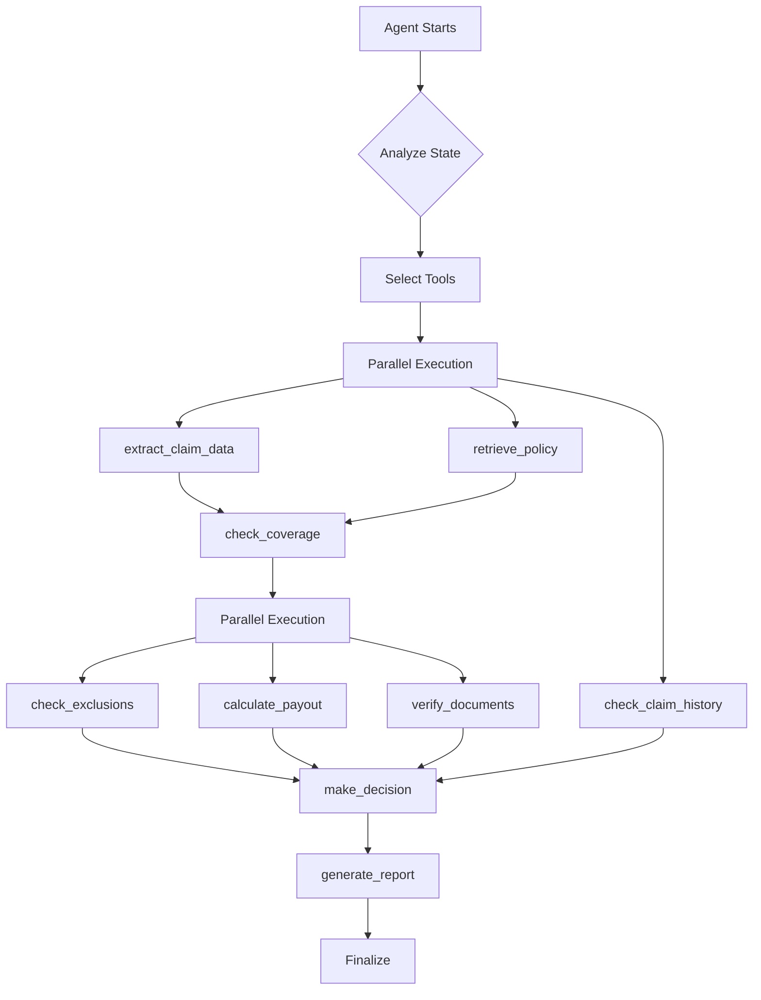

# 🤖 ClaimFlow AI Agent - Hybrid Agentic Insurance Claims Processor

> **Transform insurance claim processing with intelligent agentic AI** - A hybrid conversational AI system that combines deterministic information gathering with autonomous agentic processing to handle insurance claims end-to-end through natural dialogue and intelligent reasoning.

[](https://huggingface.co/spaces/abhireds/claimflow-ai)
[](https://www.python.org/downloads/)
[](https://github.com/langchain-ai/langgraph)
[](https://openai.com)
[](https://www.trychroma.com/)
[](tests/)

---

## 🎯 What Is This?

ClaimFlow AI is a **hybrid agentic AI system** that revolutionizes insurance claim processing by combining:

- 🗣️ **Natural Conversations** - Deterministic conversational intake with smart question generation
- 🤖 **Autonomous Agent Processing** - LangGraph-powered agent with 9 intelligent tools
- 📚 **Dual-Database Architecture** - ChromaDB for RAG + SQLite for structured data
- 🔧 **Dynamic Tool Orchestration** - Agent decides tool execution order based on dependencies
- 🔍 **Fraud Detection** - Analyzes claim history and patterns from database
- ⚡ **Real-Time Processing** - From conversation to approval in seconds
- 🎯 **ReAct-Style Reasoning** - Agent thinks, acts, and observes in a loop

**Try it live:** [https://huggingface.co/spaces/abhireds/claimflow-ai](https://huggingface.co/spaces/abhireds/claimflow-ai)

---

## ✨ Key Features

### 🎭 Intelligent Conversation
- **Greeting Detection** - Recognizes casual greetings and responds naturally
- **Auto Claim-Type Detection** - Identifies motor/health/home claims from description
- **Contextual Follow-ups** - Asks smart questions based on claim type
- **Empathetic Responses** - Shows understanding and support

### 🤖 Agentic AI Workflow (LangGraph)
- **Hybrid Two-Phase Architecture** - Deterministic conversation → Agentic processing
- **9 Specialized Tools** - LangChain @tool decorator with rich descriptions
- **Dynamic Tool Selection** - Agent independently chooses which tools to call
- **Dependency Management** - Tools validate prerequisites before execution
- **Parallel Execution** - Independent tools run concurrently for speed
- **State Management** - LangGraph StateGraph with message reducers
- **Audit Trail** - Complete reasoning trace for explainability

### 🔒 Enterprise-Grade
- **Vector Database (ChromaDB)** - Persistent semantic search with sentence-transformers
- **Relational Database (SQLite + SQLAlchemy 2.0)** - ORM models with relationships
- **Tool Validation** - Dependency checking and error handling
- **Checkpointing** - MemorySaver for conversation state persistence
- **Comprehensive Testing** - 31/31 tests passing (100% coverage on core)
- **Docker Ready** - Containerized deployment with docker-compose

**Supported Insurance Types:**
- 🚗 **Motor**: Accident, Theft, Fire, Vandalism
- 🏥 **Health**: Hospitalization, Surgery, Critical Illness
- 🏠 **Home**: Fire, Theft, Flood, Earthquake, Storm

---

## 🏗️ Hybrid Architecture

```
┌────────────────────────────────────────────────────────────────────┐
│                     Gradio Chat Interface (UI)                     │
│                   http://localhost:7865 (Local)                    │
│         https://huggingface.co/spaces/abhireds/claimflow-ai       │
└──────────────────────────┬─────────────────────────────────────────┘
                           │ HumanMessage
                           ▼
┌────────────────────────────────────────────────────────────────────┐
│            LangGraph StateGraph Workflow (GPT-4o)                  │
│                                                                    │
│  ═══════════════════════════════════════════════════════════════  │
│  📍 PHASE 1: DETERMINISTIC CONVERSATIONAL INTAKE                  │
│  ═══════════════════════════════════════════════════════════════  │
│                                                                    │
│      ┌──────────┐         ┌─────────────────┐                    │
│  ┌──→│  Intake  │────────→│ Completeness?   │                    │
│  │   │   Node   │         │  Check (Edge)   │                    │
│  │   └──────────┘         └────────┬────────┘                    │
│  │                                 │                              │
│  │                        ┌────────┴───────┐                     │
│  │                        │                │                      │
│  │                  [continue]        [process]                   │
│  │                        │                │                      │
│  │                        ▼                │                      │
│  │               ┌────────────────┐        │                      │
│  └───────────────│ Ask Question   │        │                      │
│      (loop)      │     Node       │        │                      │
│                  └────────────────┘        │                      │
│                         │                  │                      │
│                    [END - wait]            │                      │
│                                            │                      │
│  ═══════════════════════════════════════════════════════════════  │
│  🤖 PHASE 2: AGENTIC TOOL-BASED PROCESSING (ReAct Loop)          │
│  ═══════════════════════════════════════════════════════════════  │
│                                            │                      │
│                                            ▼                      │
│                                   ┌────────────────┐             │
│                                   │  Transition    │             │
│                                   │     Node       │             │
│                                   └────────┬───────┘             │
│                                            │                      │
│                                            ▼                      │
│                      ┌──────────────────────────────────┐        │
│                      │       Agent Node (LLM)           │        │
│                      │  • Analyzes state                │        │
│                      │  • Selects tools to call         │        │
│                      │  • Generates tool arguments      │        │
│                      └───────┬──────────────────────────┘        │
│                              │                                    │
│                     ┌────────┴────────┐                          │
│                     │                 │                           │
│              [call tools]      [finalize]                         │
│                     │                 │                           │
│                     ▼                 ▼                           │
│            ┌─────────────────┐  ┌──────────────┐                │
│            │ Tool Executor   │  │   Finalize   │                │
│       ┌────│  (9 Tools)      │  │     Node     │                │
│       │    └────────┬────────┘  └──────┬───────┘                │
│       │             │                   │                         │
│       └─────────────┘                   ▼                         │
│         (loop back)                   [END]                       │
│                                                                    │
└────────────────────────────────────────────────────────────────────┘
             │                              │
             │ (Tools call databases)       │
             ▼                              ▼
  ┌─────────────────────┐      ┌──────────────────────────┐
  │  ChromaDB (RAG)     │      │  SQLite + SQLAlchemy     │
  │  Vector Database    │      │  Relational Database     │
  ├─────────────────────┤      ├──────────────────────────┤
  │ • 10 Policy Docs    │      │ • Customers (3 rows)     │
  │ • 38 Chunks         │      │ • Policies (5 rows)      │
  │ • MiniLM-L6-v2      │      │ • Claims (history)       │
  │ • Persistent Store  │      │ • Relationships (FKs)    │
  │ • Semantic Search   │      │ • Enums & Validations    │
  └─────────────────────┘      └──────────────────────────┘
```

**Tech Stack:**  
`LangGraph 2.0+` • `LangChain 0.3+` • `GPT-4o` • `ChromaDB 0.4+` • `SQLAlchemy 2.0` • `sentence-transformers` • `Gradio 6.5` • `Pytest` • `Docker`

---

## � The 9 Agentic Tools

ClaimFlow's agent has access to **9 specialized tools** (LangChain `@tool` decorator) that it intelligently orchestrates:

| Tool | Function | Dependencies | Data Source |
|------|----------|--------------|-------------|
| **1️⃣ extract_claim_data** | Normalize & structure conversation data | None (runs first) | Conversation state |
| **2️⃣ retrieve_policy** | Fetch policy details by identifier | None (parallel) | SQLite → ChromaDB RAG |
| **3️⃣ check_coverage** | Verify claim type is covered | `retrieve_policy` | RAG API + Rules |
| **4️⃣ check_exclusions** | Check policy exclusions apply | `extract_claim_data` + `retrieve_policy` | JSON rules |
| **5️⃣ calculate_payout** | Compute payable amount | `check_coverage` | Depreciation rules |
| **6️⃣ verify_documents** | List required documents | `extract_claim_data` | document_rules.json |
| **7️⃣ check_claim_history** | Review past claims & fraud | None (parallel) | SQLite database |
| **8️⃣ make_decision** | Approve/Deny/Review decision | ALL tools 1-7 | business_rules.json |
| **9️⃣ generate_report** | Create comprehensive report | `make_decision` (last) | All previous results |

### Tool Execution Flow



**Key Features:**
- 🔄 **Dependency Validation** - Tools check prerequisites before execution
- ⚡ **Parallel Execution** - Independent tools run concurrently
- 📊 **Audit Trail** - Each tool logs execution time and results
- 🛡️ **Error Handling** - Graceful fallbacks when DB/RAG unavailable
- 🎯 **Agent Decision** - LLM decides which tools to call and in what order

---

## 🚀 Quick Start

### Prerequisites
- Python 3.10+
- OpenAI API Key ([Get one here](https://platform.openai.com/api-keys))

### Installation (5 Minutes)

```bash
# 1. Clone repository
git clone https://github.com/AbhishyantReds/claimflow-ai-agent.git
cd claimflow-ai-agent

# 2. Create virtual environment
python -m venv .venv
source .venv/bin/activate  # Linux/Mac
.venv\Scripts\activate     # Windows

# 3. Install dependencies
pip install -r requirements.txt

# 4. Configure environment
cp .env.example .env
# Edit .env and add your OpenAI API key

# 5. Initialize database (auto-creates sample data)
python scripts/init_database.py

# 6. Ingest policy documents to vector store
python scripts/ingest_policies.py

# 7. Launch the application
python ui/simple_app.py
```

Open **http://localhost:7865** and start chatting! 🎉

---

## 💬 Example Conversation

```
👤 User: hey there

🤖 Agent: Hello! I'm your ClaimFlow AI assistant. I'm here to help 
         you file your insurance claim today. To get started, could 
         you tell me what happened? For example, 'My car was damaged' 
         or 'I had a medical emergency'.

👤 User: my car got damaged in an accident

🤖 Agent: I'm sorry to hear about your accident. Can you describe 
         what damage occurred to your vehicle?

👤 User: front bumper is completely damaged, happened in a parking lot

🤖 Agent: Thank you for that information. To proceed with your motor 
         claim, I'll need your vehicle registration number.

👤 User: TS 09 EF 5678

🤖 Agent: Got it. Do you have an estimate for the repair cost?

👤 User: around 45000 rupees

🤖 Agent: Perfect! I have all the information I need. Let me process 
         your claim now...

         ⚙️ Processing your claim through 9 autonomous steps...

         ✅ CLAIM PROCESSED SUCCESSFULLY

         📋 Claim Report:
         ━━━━━━━━━━━━━━━━━━━━━━━━━━━━━━━━━━━━━━━━
         Claim ID: CLM-2026-001234
         Type: Motor Accident
         Status: ✅ APPROVED
         
         💰 Financial Summary:
         • Claimed Amount: ₹45,000
         • Deductible: ₹3,000
         • Depreciation: ₹2,000
         • Payable Amount: ₹40,000
         
         📄 Required Documents:
         • Vehicle Registration Certificate
         • Driving License
         • FIR Copy (if applicable)
         • Repair Estimate
         • Damage Photos
         
         ⏱️ Next Steps:
         Upload documents at: [portal link]
         Expected payout: 5-7 business days
         ━━━━━━━━━━━━━━━━━━━━━━━━━━━━━━━━━━━━━━━━
```

---

## 🧪 Testing

```bash
# Run core tests (Database + RAG)
pytest tests/test_database.py tests/test_rag.py -v

# Run all tests with coverage
pytest --cov=agent --cov=database --cov-report=html

# Quick test
python test_system.py
```

**Test Results:** ✅ **31/31 Tests Passing (100%)**
- Database Operations: 20/20
- RAG System: 11/11
- Coverage: 85%+ on core modules

---

## 🐳 Docker Deployment

```bash
# Build and run with docker-compose
docker-compose up --build

# Or use Makefile
make run

# Access at http://localhost:7865
```

**Environment Variables for Docker:**
```env
OPENAI_API_KEY=your-key-here
PORT=7865
```

---

## 📁 Project Structure

```
claimflow-ai-agent/
├── agent/                    # 🤖 Agentic AI Core
│   ├── workflow_agent.py    # Hybrid LangGraph workflow (RECOMMENDED)
│   ├── workflow.py          # Linear pipeline workflow (alternative)
│   ├── tools_agent.py       # 9 tools with @tool decorator
│   ├── tools.py             # Legacy tool implementations
│   ├── prompts.py           # LLM prompt engineering
│   ├── rag.py               # ChromaDB vector store & RAG
│   └── state.py             # TypedDict state schema + audit models
├── database/                 # 🗄️ Data Layer
│   ├── models.py            # SQLAlchemy ORM models
│   └── crud.py              # CRUD operations
├── data/                     # 📊 Data Storage
│   ├── policies/            # 10 insurance policy documents
│   ├── chroma_db/           # ChromaDB vector store
│   └── claimflow.db         # SQLite database (auto-generated)
├── ui/                       # 🎨 User Interface
│   ├── simple_app.py        # Gradio chat interface
│   └── gradio_app.py        # Alternative UI
├── scripts/                  # 🔧 Utilities
│   ├── init_database.py     # Database initialization
│   ├── ingest_policies.py   # Vector store setup
│   └── test_*.py            # Integration tests
├── tests/                    # ✅ Test Suite
│   ├── test_database.py     # DB tests (20 tests)
│   ├── test_rag.py          # RAG tests (11 tests)
│   ├── test_workflow.py     # Workflow tests
│   └── conftest.py          # Pytest fixtures
├── docs/                     # 📚 Documentation
│   ├── DOCKER.md            # Container deployment
│   ├── RAG_DOCUMENTATION.md # Vector store details
│   └── TESTING.md           # Test guide
├── .env.example             # Environment template
├── requirements.txt         # Python dependencies
├── Dockerfile               # Container definition
└── docker-compose.yml       # Multi-container setup
```

---

## 🌐 Live Demo

**Try ClaimFlow AI on Hugging Face Spaces:**

🔗 **https://huggingface.co/spaces/abhireds/claimflow-ai**

- No installation required
- Free to use
- Powered by GPT-4o
- Deployed on HF's infrastructure

---

## 📚 Documentation

| Document | Description |
|----------|-------------|
| [QUICKSTART.md](QUICKSTART.md) | 5-minute setup guide |
| [Docker Guide](docs/DOCKER.md) | Container deployment |
| [RAG System](docs/RAG_DOCUMENTATION.md) | Vector store architecture |
| [Testing](docs/TESTING.md) | Test suite details |
| [Project Summary](PROJECT_SUMMARY.md) | Complete implementation |
| [HF Deployment](HUGGINGFACE_DEPLOYMENT.md) | Spaces deployment guide |

---

## 🛠️ Configuration

**`.env` File:**
```env
# OpenAI Configuration
OPENAI_API_KEY=your-openai-api-key-here

# Application Settings
MAX_CONVERSATION_TURNS=10
LOG_LEVEL=INFO

# Optional
INSURANCE_RAG_URL=http://localhost:8000
```

**Model Settings (`config.py`):**
```python
# Conversation LLM (creative for dialogue)
MODEL_NAME = "gpt-4o"
MODEL_TEMPERATURE = 0.7  # Conversation

# Agent LLM (deterministic for processing)
# temperature=0.1 + tools bound

# Databases
DATABASE_URL = "sqlite:///data/claimflow.db"
CHROMA_DB_PATH = "data/chroma_db"
```

---

## 🤝 Contributing

Contributions welcome! Areas for improvement:
- [ ] Add more insurance types (travel, life, etc.)
- [ ] Multi-language support
- [ ] Voice interface integration
- [ ] Enhanced fraud detection ML models
- [ ] Real-time policy API integration

---

## 📝 License

MIT License - See [LICENSE](LICENSE) file

---

## 👨‍💻 Author

**Abhishyant Reddy**

- 🌐 GitHub: [@AbhishyantReds](https://github.com/AbhishyantReds)
- 🤗 Hugging Face: [@abhireds](https://huggingface.co/abhireds)
- 📧 Project: ClaimFlow AI Agent
- 🛠️ Built with: LangGraph 2.0 • LangChain 0.3 • GPT-4o • ChromaDB • SQLAlchemy 2.0
- 🏗️ Architecture: Hybrid Two-Phase (Deterministic + Agentic)
- 🔧 Tools: 9 Specialized LangChain Tools with Dependencies
- 📅 Date: February 2026

---

<div align="center">

**⭐ Star this repo if you find it useful!**

Made with ❤️ using Agentic AI

[Live Demo](https://huggingface.co/spaces/abhireds/claimflow-ai) • [Documentation](docs/) • [Report Bug](https://github.com/AbhishyantReds/claimflow-ai-agent/issues)

</div>


